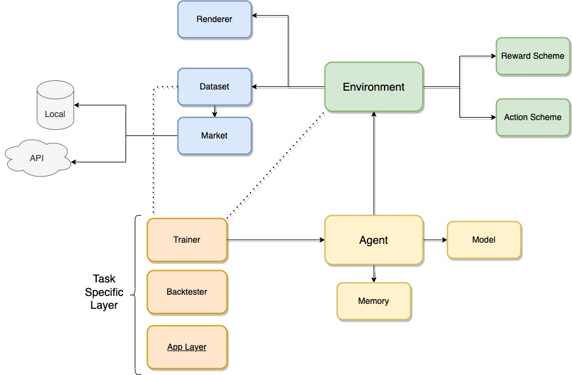
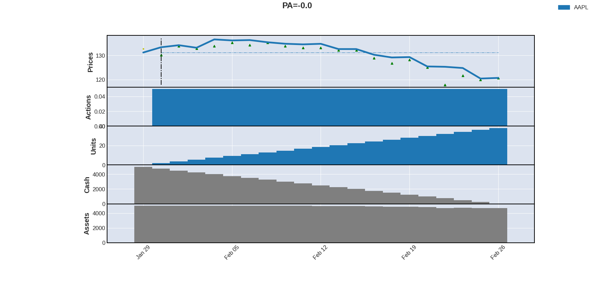
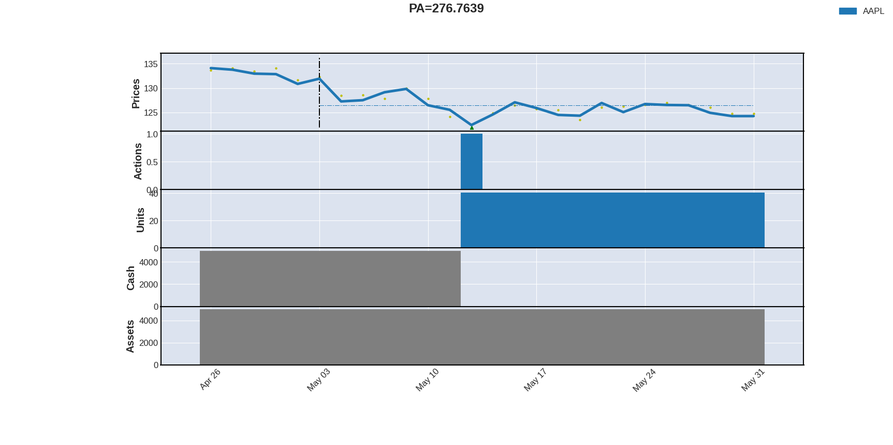
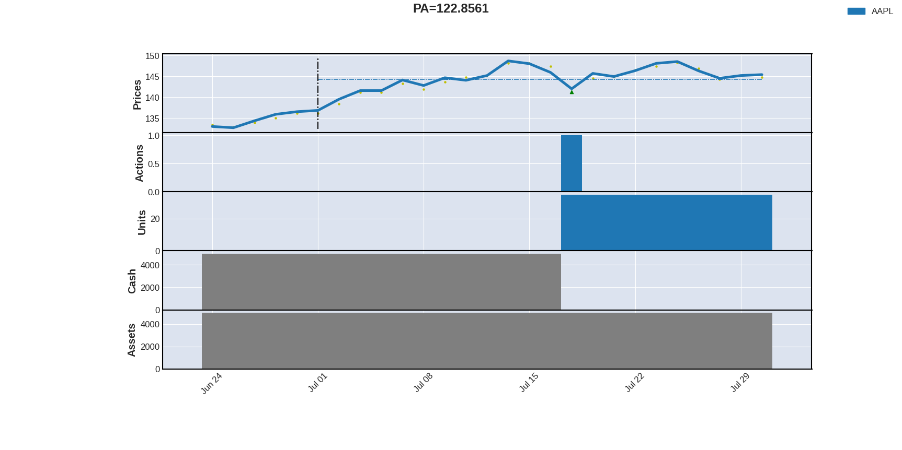
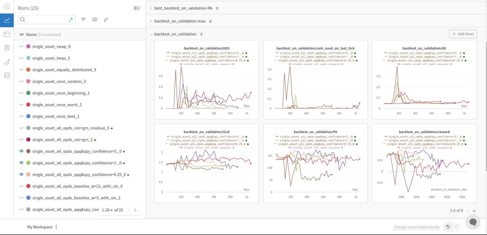

<a href="https://www.linkedin.com/in/pauliusztin" style="text-align:center">
    <picture>
      <source media="(prefers-color-scheme: dark)" srcset="./images/yacht_full_logo_white.png">
      <source media="(prefers-color-scheme: light)" srcset="./images/yacht_full_logo_black.png">
      
    </picture>
</a>

# Yacht: Yet Another Comprehensive Trading Framework Using Deep Reinforcement Learning
A Deep Reinforcement Learning framework for trading & order execution in financial markets. The goal of the project
is to speed up the development & research of financial agents. The code has components for:
* Loading & preprocessing data directly from the Yahoo Finance API
* Training & evaluating deep reinforcement learning agents
* Use specific financial metrics or easily implement your own
* Visualizing the performance of the agent with some intuitive graphs

The nice part is that everything is `configurable` within a config file.
<br> The code is using popular packages like:
* pytorch
* pandas
* stable-baselines3
* gym
* wandb
* mplfinance

Relative to other repositories, with the same scope, on this one a lot of focus 
was on researching better components:
* Preprocessing methods to make data stationary
* Training methods: Supervised heads, Teacher Oracles etc.
* Different models: Recurrent, Transformers etc.

# Project Architecture

<br><br>The architecture is split into 4 main categories:
* Data
* Environment
* Reinforcement Learning Agents
* Specific Task Layer

The `Specific Task Layer` is a glue code module that is used for training & backtesting.
It can be further be extended into the `applicaton layer`.

# Visual Representations
Visual representations of the actions taken by the agent & the current status of the agent:





# Install
### Requirements
* Code tested under `Python 3.8`, `pytorch 1.13.0`, and `cuda 11.6` on `Ubuntu 20.04`

1. Create a conda environment and activate it.

2. Install torch and cuda separately with `conda`:
```shell
conda install pytorch=1.13.0 torchvision torchaudio pytorch-cuda=11.6 -c pytorch -c nvidia
```

3. Ultimately, install other requirements with `pip`:
```shell
pip install -r requirements.txt
```

### Config Compiler
* The configuration system is built with `google protobuf`. If you want to recompile / change the protobuf files,
you should install the `protoc` compiler on your system:
```shell
sudo apt  install protobuf-compiler libprotobuf-dev
```
* Run the `compilation` command from the root folder:  
```shell
  protoc -I=. --python_out=. yacht/config/proto/*.proto
  ```

### Add Secret Keys
* Create a file called `.env` at the root directory level. If you want to fully use the market APIs and
experiment trackers you should add the secret keys.
* Look at `.env.default` for the supported env vars.
* Not all `env vars` are mandatory. For example the free version of `Yahoo Finance` does not require any credentials.

----------

# Data APIs
* Currently, we have support for:
  * `Binance`
  * `Yahoo Finance`.
* You should set the `api keys` in the `.env` file for full support.

# Datasets & Download Data
* S&P 500
* Dow 30
* Nasdaq 100
* Russell 2000

You can set `tickers: ['NASDAQ100']` in the configuration file and all the tickers from the index will be expanded.
You can also set something like `['NASDAQ100', 'S&P500', 'AAPL']` or any combination you like.
#### Download
We cache the data in `h5` files.
```shell
python main.py download --config-file-name download_4years.config.txt --storage-dir ./storage/download_4_years --market-storage-dir ./storage
```
* The `--market-storage-dir` CLI argument is optional. If you add it the market will be placed
in a different location than your `storage-dir`. This is helpful because it can be accessed by multiple
experiments in parallel `during training` (the `h5` file will be set in a read only mode). Otherwise, while training,
only one experiment can access a specific file. 
* `--market-storage-dir` should be used also during `training` & `backtesting`
* You can use the `market_mixins: [...]` to preprocess the data before it is cached.

-------

# Usage
All the supported configs can be found at `./yacht/config/configs`. 
You should only add the config path relative to the root directory.

### Train
```shell
python main.py train --config-file order_execution/all/single_asset_all_universal_silent.config.txt --storage-dir ./storage/yacht --market-storage-dir ./storage
```

### Backtest
```shell
python main.py backtest --config-file order_execution/all/single_asset_all_universal_silent.config.txt --storage-dir ./storage/yacht --market-storage-dir ./storage
```

### Download Pretrained Weights 👇🏻
You can download the pretrained weights from [here](https://drive.google.com/drive/folders/1uPGTWPz2U-9LfyCExQ8UXcuyqXB_yosp?usp=share_link).

```shell
cd /root/directory
mkdir storage
--> place the downloaded weights in ./storage 
```

If you downloaded and placed the pretrained weights correctly as showed above, you can run the following command to resume the agent:
```shell
python main.py train --config-file order_execution/all/single_asset_all_universal_silent.config.txt --storage-dir ./storage/yacht --resume-from latest-train --market-storage-dir ./storage
```
For the parameter `--resume-from` we support the following combinations:
* Absolute path to the checkpoint.
* `latest-train` = resume the agent from the latest checkpoint saved during training
* `best-train` = resume the agent from the best checkpoint saved during training

**NOTE:** For the `best-train` parameter, you can choose a metric on which the agent was monitored. You
can do that with the `meta.metrics_to_load_best_on` parameter from the configuration file. For example, `metrics_to_load_best_on: ['PA', 'GLR']`
will load two agents: The agent monitored on the metric `PA` & the one who performed the best on `GLR`.

# Tutorials
* [Get started](https://medium.com/mlearning-ai/how-to-automate-your-orders-as-a-buy-and-hold-investor-84f6885015aa)

------

# Experiment Tracking
### Weights & Biases
* For now, we support `wandb` for experiment tracking and logging.
* Just add the api key in the `.env` file. Also, in the configuration file you should add:
```shell
meta: {
  experiment_tracker: 'wandb'
}
```
If you want to add a specific `project_entity` add:
```shell
meta: {
  project_entity: 'your_project_entity'
} 
```
**NOTE:** Be aware that this name is unique between all the users that use wandb. For
example, I use `project_entity=yacht`. If you try to use it  will through an unauthorized error
because you do not have access to my entity.
<br/>Here is an example of how it looks:

* If you don't want to log a specific experiment on the experiment tracker just remove the config
field or replace it with the empty string `''`.

# Hyperparameter Optimization
### Weights & Biases
* We support yyperparameter optimization with weights & biases sweeps.
* Weights & biases should work as a simple experiment tracker before using this.
* You can use any other config from `tools/tuning/configs` or generate your own.
```shell
wandb sweep tools/tuning/configs/single_asset_order_execution_crypto.yaml
wandb agent id-given-by-generated-sweep
```

--------

# More Resources
For further reading go to:
* [Available Components](docs/components.md)
* [Config Explanation](docs/config.md)
* [Trading](docs/trading.md)
* [Order Execution](docs/order_execution.md)
* [Metrics](docs/metrics.md)
* [Teacher-Student](docs/teacher.md)
