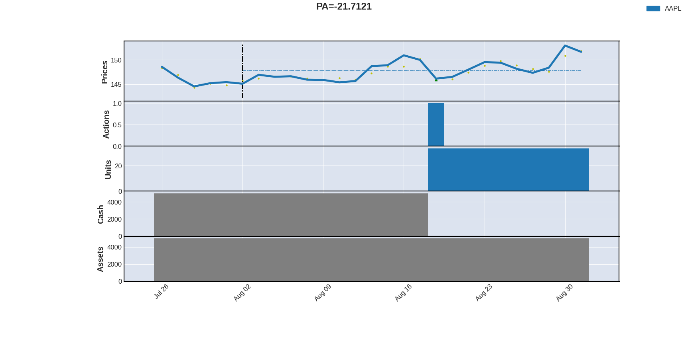
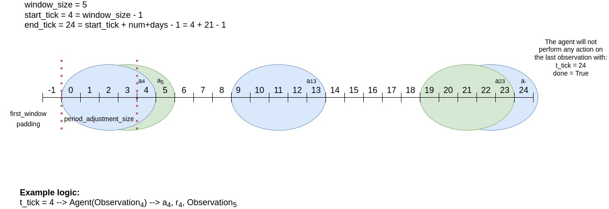

# Description
For now our codebase is inspired by the paper [Universal Trading for Order Execution with Oracle Policy Distillation](https://arxiv.org/abs/2103.10860). 
But we made a few changes to make it more generic & robust:
* The setup can we used on any kind of asset timeseries.
* The actions are taken only at one timestep based on some lagged observations.
* You can use it at any timescale: 1 year, 1 month, 1 day
* We have improved the preprocessing method so the data is stationary.
* We have added a supervised head to help learning.
* We have added as input reference indexes, like S&P500 & Nasdaq100 to help the agent to find the trend.
* We have improved the model to help the agent to pick features from different variables.

A detailed explanation of those improvements can be found at the following [paper]().
 Here are some examples of how the agent is performing:

This is how the agent is taking the actions:

